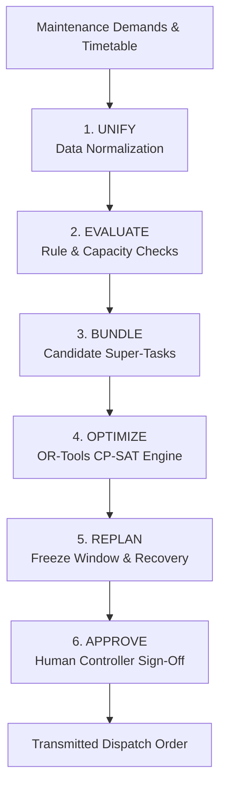
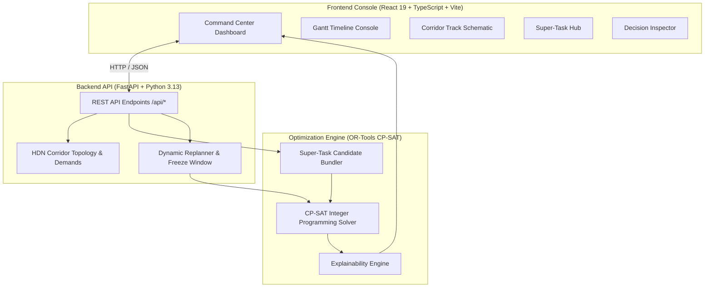

# 🚆 RailSync

### Synchronizing Maintenance. Maximizing Availability.

**SIH26027 · Smart India Hackathon 2026 · Team ANTIMATTER**

RailSync is an intelligent multi-department maintenance block planning and conflict-avoidance system designed for high-density railway corridors of Indian Railways. By leveraging Google OR-Tools CP-SAT integer constraint programming, RailSync unifies fragmented maintenance demands across departments into co-located Super-Tasks, eliminates train-block schedule conflicts, and enables dynamic recovery during operational disruptions.

---

## 🎯 Problem

High-density railway corridors operate under constant pressure to balance heavy passenger and freight train traffic with mandatory infrastructure maintenance. Maintenance operations are requested by multiple independent departments:

- **Engineering (P-Way):** Track tamping, rail grinding, turnout renewal, USFD flaw detection.
- **Signalling & Telecom (S&T):** Point machine overhaul, digital axle counter calibration, track circuit bonding.
- **Traction Distribution (TRD / OHE):** Contact wire inspection, insulator washing, neutral section modification.
- **Mechanical (C&W):** Hot box detector calibration, freight siding track maintenance.

Uncoordinated planning causes severe operational bottlenecks:
- **Fragmented Track Possessions:** Departments request isolated track blocks on the same section at different times, multiplying line capacity loss.
- **Train Delays:** Unscheduled or poorly timed maintenance blocks force high-priority trains (*Vande Bharat*, *Rajdhani*, *Shatabdi*) to stop or slow down.
- **Disruption Fragility:** When an unplanned track or signal defect occurs, manual replanning struggles to re-align future maintenance without causing cascading delays.

---

## 💡 Solution

RailSync provides an automated, centralized scheduling engine that models the corridor as a unified constraint optimization problem.

```
  ┌──────────────────────┐
  │  Maintenance Demands │
  └──────────┬───────────┘
             │
  ┌──────────▼───────────┐     ┌────────────────────────┐
  │   Train Operations   ├────►│ RailSync Optimization  │
  └──────────┬───────────┘     │        Engine          ├────► Optimized Block Plan
             │                 │ (OR-Tools CP-SAT)      │      & Dispatch Order
  ┌──────────▼───────────┐     └────────────────────────┘
  │ Dynamic Disruptions  │
  └──────────────────────┘
```

RailSync processes departmental maintenance demands, published train timetables, electrical zone topologies, and equipment resource availability to generate a conflict-free schedule that maximizes track availability and minimizes total train delay.

> **Note on Data:** The current prototype demonstrates full optimization capabilities using synthetic data modeled after the **HDN-1 High-Density Corridor** (*Ghaziabad – Aligarh – Kanpur*).

---

## 🔄 How RailSync Works

RailSync executes a six-stage pipeline to transform raw maintenance demands into an approved dispatch order:



1. **UNIFY:** Normalizes input demands across Engineering, S&T, TRD, and Mechanical into a unified 24-hour discrete timeline ($0$ to $1440$ minutes).
2. **EVALUATE:** Validates time windows, section directionality, electrical zones, and specialized equipment resources.
3. **BUNDLE:** Pre-analyzes overlapping departmental demands on common track sections to construct candidate multi-department **Super-Tasks**.
4. **OPTIMIZE:** Solves an Integer Linear Constraint Programming model using **Google OR-Tools CP-SAT** to maximize downtime savings and minimize train delays.
5. **REPLAN:** In the event of a track or signal disruption, locks/freezes historical operations while re-optimizing unexecuted future blocks.
6. **APPROVE:** Presents the recommended schedule to the Senior Operational Controller for formal review, remarks, and digital sign-off.

---

## 🧠 Optimization Engine

The core solver is built on **Google OR-Tools CP-SAT** (`ortools.sat.python.cp_model`), solving a multi-objective constraint satisfaction problem over a discrete 24-hour horizon ($1440$ minutes).

### Implemented Mathematical Constraints

- **Track Section Non-Overlap (`AddNoOverlap`):** Guarantees that at any point in time, a track section is occupied by at most one entity—either a train traversal, a single maintenance block, a Super-Task, or an active disruption blockage.
- **TRD Catenary Power Isolation:** Hard constraint mapping OHE power blocks to electrical traction zones (`OHE-ZONE`). When a maintenance demand requires a power block (`requires_power_block = True`), no electric train traversal is permitted anywhere within the affected electrical zone during that window.
- **Train Headway Buffers:** Enforces a minimum safety headway buffer ($10$ minutes) between consecutive trains traversing the same section in the same direction.
- **Equipment Resource Non-Overlap:** Ensures shared specialized machinery (e.g. *Tower Wagon*, *Track Tamper*, *USFD Flaw Detector*) cannot be scheduled in two places simultaneously.
- **Super-Task Uniqueness:** Enforces that each maintenance demand is satisfied at most once—either as part of a bundled Super-Task or as a standalone block.
- **Train Priority Protection:** Priority-weighted delay penalty function in the objective function. High-priority VVIP services (*Priority Class 1*: Vande Bharat, Rajdhani, Shatabdi) carry high delay penalties to guarantee zero or minimal schedule disturbance.
- **Soft-Relaxation (`FEASIBLE_RELAXED` Mode):** If a severe capacity disruption renders hard constraints infeasible, Phase 2 automatically activates routine demand deferral (`DemandPriorityEnum.ROUTINE`) while strictly maintaining safety constraints and VVIP train timetables.

### Objective Function

$$\text{Maximize } \sum \left( W_{\text{demand}} \cdot X_{\text{executed}} \right) + \sum \left( B_{\text{super}} \cdot Y_{\text{active}} \right) - \sum \left( P_{\text{train}} \cdot \Delta t_{\text{delay}} \right)$$

Where:
- $W_{\text{demand}}$: Priority weight ($5000$ for Emergency, $1500$ for High, $500$ for Routine).
- $B_{\text{super}}$: Bonus proportional to net track downtime minutes saved by bundling.
- $P_{\text{train}}$: Penalty weight for train arrival delay ($500$ for Class 1 VVIP, $150$ for Class 2 Express, $30$ for Freight).

---

## 🚧 Super-Tasks

A **Super-Task** is a co-located maintenance block that unifies overlapping demands from different departments on the same track section.

### Synthetic Demonstration Scenario Example

In the HDN-1 synthetic test scenario on section `SEC-UP-GZB-ALJN` (*Ghaziabad - Aligarh UP Main*):

- **Demand 1 (P-Way):** `DEM-ENG-101` — BCM Track Tamping (Duration: $120$ mins, Window: 01:00 – 05:00).
- **Demand 2 (TRD/OHE):** `DEM-TRD-201` — OHE Contact Wire Inspection (Duration: $90$ mins, Window: 01:00 – 05:00).

```
Un-optimized Isolated Blocks:
  P-Way Block : [══════════════ 120 mins ══════════════]
  OHE Block   :                                          [═════════ 90 mins ═════════]
  Total Downtime = 120 + 90 = 210 mins

RailSync Super-Task (ST-GZB-ALJN-01):
  Super-Task  : [══════════════════════ 135 mins ══════════════════════]
  Net Track Downtime Saved = 75 mins (35.7% reduction)
```

By co-locating P-Way and TRD crews under a single $135$-minute window (max duration + $15$ min safety buffer), RailSync saves **$75$ minutes of track downtime** in this synthetic scenario.

---

## ⚡ Disruption & Dynamic Replanning

When real-world operational disruptions occur, RailSync executes dynamic recovery without invalidating previously executed operations.

```
  ┌──────────────────┐
  │   NORMAL PLAN    │
  └────────┬─────────┘
           │ Emergency Disruption Injected (e.g. Rail Defect at Km 54)
  ┌────────▼─────────┐
  │ FREEZE HISTORY   ├────► Locks past/in-progress blocks (clock_min)
  └────────┬─────────┘
           │
  ┌────────▼─────────┐
  │ RE-OPTIMIZE      ├────► CP-SAT engine re-runs on remaining horizon
  └────────┬─────────┘
           │
  ┌────────▼─────────┐
  │   NEW PLAN       ├────► Incremental diff computed (moved blocks, train delays)
  └────────┬─────────┘
           │
  ┌────────▼─────────┐
  │ HUMAN APPROVAL   ├────► Senior Controller signs off
  └──────────────────┘
```

### Supported Solver Statuses

- `OPTIMAL`: Optimal solution found meeting all hard constraints.
- `FEASIBLE`: Valid feasible solution found within solver time limit.
- `REOPTIMIZED`: Schedule re-optimized following a disruption with historical activity frozen.
- `FEASIBLE_RELAXED`: Phase 2 fallback activated; routine demands deferred to resolve capacity bottlenecks.
- `INFEASIBLE`: No valid schedule possible without violating physical track safety.

---

## 🔍 Explainability System

RailSync features a deterministic **Traceable Explainability Engine** (`explainability.py`) that inspects final CP-SAT model variable assignments to generate human-readable rationale cards:

- **Super-Task Co-location:** Quantifies exact downtime minutes saved and lists bundled departments.
- **VVIP Train Protection:** Confirms zero-delay protection for trains like Vande Bharat and Shatabdi.
- **Off-Peak Shift Rationale:** Explains why heavy maintenance blocks were concentrated into night windows ($01:00 - 06:00$).
- **Disruption Impact Summary:** Outlines which unexecuted tasks were shifted and why.

> **Note:** Explanations are derived $100\%$ deterministically from solver decision variables (`m_starts`, `t_delays`, `st_active`). No LLM or generative text is used.

---

## 👤 Human-in-the-Loop Governance

RailSync is built strictly as a **decision-support platform** for railway controllers:

1. **System Recommends:** CP-SAT engine generates an mathematically optimal schedule.
2. **Human Reviews:** Senior Operational Controller reviews KPIs, Super-Tasks, and Gantt timeline.
3. **Controller Signs Off:** Controller adds mandatory sign-off remarks and clicks **Sign & Transmit Dispatch Order**.
4. **Order Dispatched:** Approved dispatch order status (`APPROVED`) is transmitted to Division Control Offices.

*RailSync does not autonomously alter signals or control train movement.*

---

## 🏗️ Architecture



---

## 🛠️ Tech Stack

| Layer | Technology | Purpose |
| :--- | :--- | :--- |
| **Frontend Framework** | React 19 (TypeScript) | Reactive UI components & state management |
| **Build & Tooling** | Vite 8, Tailwind CSS v4, Oxlint | High-performance styling, bundling & linting |
| **Icons & UI** | Lucide React | Visual operational indicators |
| **Backend Framework** | Python 3.13 / FastAPI | RESTful API server & async endpoint handling |
| **Data Validation** | Pydantic v2 | Strict JSON schema validation |
| **Optimization Engine**| Google OR-Tools CP-SAT (`ortools`) | Integer Linear Constraint Programming solver |
| **Data Processing** | Pandas, NumPy | Data manipulation & baseline metrics calculations |
| **Testing** | Pytest | Automated backend unit and solver testing |

---

## 📁 Project Structure

```
RailSync/
├── backend/
│   ├── app/
│   │   ├── data/
│   │   │   ├── baseline_heuristic.py   # Heuristic baseline generator for comparison
│   │   │   └── corridor_hdn.py         # Synthetic HDN-1 corridor topology & demands
│   │   ├── models/
│   │   │   └── schema.py               # Pydantic data schemas & enums
│   │   ├── solver/
│   │   │   ├── bundler.py              # Super-Task candidate generation
│   │   │   ├── cpsat_engine.py         # OR-Tools CP-SAT model & constraints
│   │   │   ├── explainability.py       # Deterministic decision explanation generator
│   │   │   └── replanner.py            # History freeze & dynamic recovery engine
│   │   ├── tests/
│   │   │   └── test_solver.py          # Pytest suite for solver correctness
│   │   └── main.py                     # FastAPI REST API routes & CORS middleware
│   └── requirements.txt                # Backend dependencies
│
├── frontend/
│   ├── src/
│   │   ├── components/
│   │   │   ├── ApprovalModal.tsx       # Human controller sign-off modal
│   │   │   ├── CommandHero.tsx         # Executive command panel & pipeline stepper
│   │   │   ├── CorridorOverview.tsx    # Interactive track schematic
│   │   │   ├── DecisionInspector.tsx   # Rationale & explainability viewer
│   │   │   ├── DisruptionDrawer.tsx    # Operational disruption injection drawer
│   │   │   ├── GanttConsole.tsx        # High-density operational timeline
│   │   │   ├── Header.tsx              # System navigation & telemetry bar
│   │   │   ├── KpiHeader.tsx           # Operational KPI telemetry cards
│   │   │   └── SuperTaskHub.tsx        # Multi-department co-location inspector
│   │   ├── services/
│   │   │   └── api.ts                  # Axios REST API client
│   │   ├── types/
│   │   │   └── index.ts                # TypeScript data interfaces
│   │   ├── App.tsx                     # Primary dashboard layout & state orchestrator
│   │   ├── index.css                   # Global theme & Tailwind CSS v4 imports
│   │   └── main.tsx                    # React application entry point
│   ├── index.html                      # Page shell & Google Fonts preconnects
│   ├── vite.config.ts                  # Vite configuration & Tailwind plugin
│   └── package.json                    # Frontend dependencies
│
├── .gitignore
└── README.md
```

---

## 🚀 Getting Started

### Prerequisites

- **Python 3.11+** (Python 3.13 recommended)
- **Node.js 18+** & **npm**

---

### 1. Launch Backend API

```bash
# Navigate to backend directory
cd backend

# Create and activate virtual environment
python -m venv venv
# On Windows:
venv\Scripts\activate
# On Linux/macOS:
source venv/bin/activate

# Install backend dependencies
pip install -r requirements.txt

# Run backend unit test suite
python -m pytest

# Start FastAPI server
python -m uvicorn app.main:app --reload --port 8000
```

The FastAPI REST backend will be running at `http://127.0.0.1:8000`.  
Swagger interactive API documentation is accessible at `http://127.0.0.1:8000/docs`.

---

### 2. Launch Frontend Console

Open a new terminal window:

```bash
# Navigate to frontend directory
cd frontend

# Install Node dependencies
npm install

# Verify production build compilation
npm run build

# Start Vite development server
npm run dev -- --port 5173
```

Open `http://localhost:5173` in your browser to interact with the RailSync Command Center.
